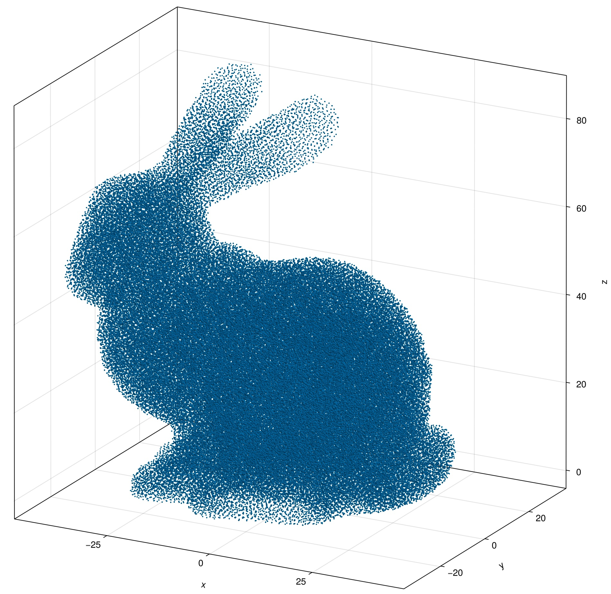

# WhatsThePoint.jl

[](https://github.com/JuliaMeshless/WhatsThePoint.jl/actions/workflows/CI.yml?query=branch%3Amain)
[](https://JuliaMeshless.github.io/WhatsThePoint.jl/stable)
[](https://JuliaMeshless.github.io/WhatsThePoint.jl/dev)
[](https://github.com/JuliaMeshless/WhatsThePoint.jl/blob/master/LICENSE)
[](https://codecov.io/gh/JuliaMeshless/WhatsThePoint.jl)

A Julia package for generating and manipulating point clouds for meshless PDE methods — RBF-FD, generalized finite differences, SPH, and related techniques. Part of the [JuliaMeshless](https://github.com/JuliaMeshless) organization.

**[Full documentation](https://JuliaMeshless.github.io/WhatsThePoint.jl/stable)**

> [!NOTE]
> WhatsThePoint.jl is under active development. The API may change before v1.0.

## Features

- **Spacing guidance** — `suggest_spacing` probes a geometry and recommends a baseline node spacing before you generate anything
- **Surface import** from STL and other mesh formats via [GeoIO.jl](https://github.com/JuliaEarth/GeoIO.jl), plus **Poisson-disk surface sampling** (`PointBoundary(mesh, spacing)`) at a prescribed spacing
- **Volume discretization** with multiple algorithms:
  - `SlakKosec` and `VanDerSandeFornberg` (3D)
  - `FornbergFlyer` (2D)
  - `Octree` — spacing-driven adaptive fill (3D); its default `:bridson` placement runs a global graded Poisson-disk front with automatic point budgeting and optional gradient-limited spacing (`max_growth`)
- **Octree-accelerated spatial queries** via `TriangleOctree` for fast point-in-volume testing
- **Normal computation and orientation** using PCA with MST+DFS consistent orientation (Hoppe 1992)
- **Node repulsion** for optimizing point distributions (Miotti 2023)
- **Distribution quality metrics** — `metrics`, `spacing_metrics`, `spacing_fidelity_metrics` (separation, fill, mesh ratio, d_NN/h statistics)
- **Point connectivity** with k-nearest neighbor and radius-based topology
- **Full unit support** through [Unitful.jl](https://github.com/PainterQubits/Unitful.jl)
- **Visualization** with [Makie.jl](https://github.com/MakieOrg/Makie.jl) and **ParaView export** (`export_vtk`, with solution fields)

## Installation

```julia
] add https://github.com/JuliaMeshless/WhatsThePoint.jl
```

## Quick Example

```julia
using WhatsThePoint, Unitful

# Import a surface mesh
boundary = PointBoundary("model.stl")

# Split surfaces by normal angle
split_surface!(boundary, 75°)

# Generate volume points
spacing = ConstantSpacing(1u"mm")
cloud = discretize(boundary, spacing; alg=VanDerSandeFornberg(), max_points=100_000)

# Optimize point distribution
cloud = repel(cloud, spacing; β=0.2, max_iters=1000)

# Add point connectivity
cloud = set_topology(cloud, KNNTopology, 21)

# Visualize
using GLMakie
visualize(cloud; markersize=0.15)
```

See the [documentation](https://JuliaMeshless.github.io/WhatsThePoint.jl/dev) for the full guide.


