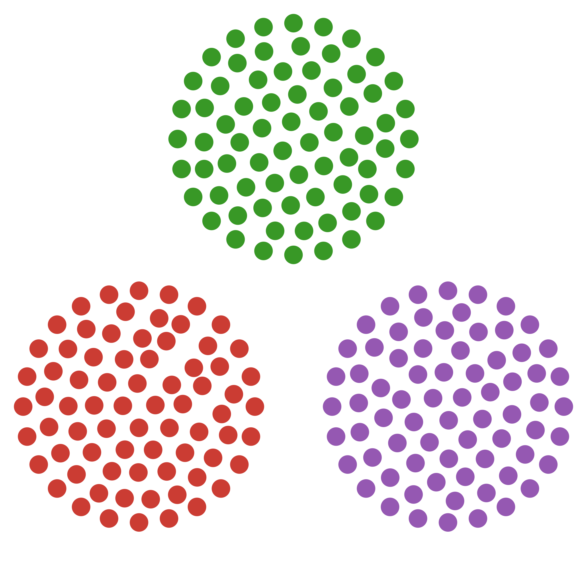
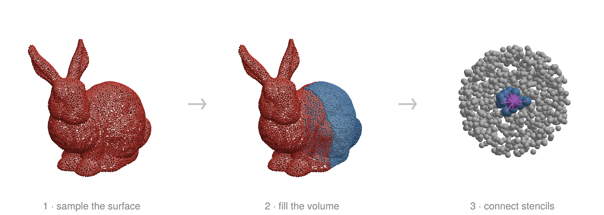
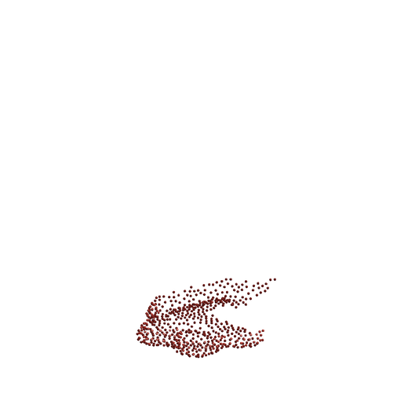

<p align="center">
  
</p>

<h1 align="center">WhatsThePoint.jl</h1>

<p align="center"><em>Generate, optimize, and connect point clouds for meshless PDE methods.</em></p>

<p align="center">
  <a href="https://github.com/JuliaMeshless/WhatsThePoint.jl/actions/workflows/CI.yml?query=branch%3Amain"></a>
  <a href="https://JuliaMeshless.github.io/WhatsThePoint.jl/dev"></a>
  <a href="https://github.com/JuliaMeshless/WhatsThePoint.jl/blob/main/LICENSE"></a>
  <a href="https://codecov.io/gh/JuliaMeshless/WhatsThePoint.jl"></a>
</p>



Meshless methods — RBF-FD, generalized finite differences, SPH — need well-distributed point clouds with neighbor connectivity, but getting from a CAD surface to solver-ready points is tedious. WhatsThePoint.jl handles the complete pipeline: surface import, volume discretization, distribution optimization, and stencil connectivity, in a few lines of Julia. Part of the [JuliaMeshless](https://github.com/JuliaMeshless) organization.

**[Full documentation](https://JuliaMeshless.github.io/WhatsThePoint.jl/dev)**

> [!NOTE]
> WhatsThePoint.jl is under active development. The API may change before v1.0.

## Installation

```julia
] add https://github.com/JuliaMeshless/WhatsThePoint.jl
```

## Quick Example

```julia
using WhatsThePoint, Unitful

# Import a surface mesh — the unit says what the file's raw numbers mean
boundary = PointBoundary("model.stl", u"mm")

# Split surfaces by normal angle
split_surface!(boundary, 75°)

# Generate volume points
spacing = ConstantSpacing(1u"mm")
cloud = discretize(boundary, spacing; alg=VanDerSandeFornberg(), max_points=100_000)

# Optimize point distribution
cloud = repel(cloud, spacing; β=0.2, max_iters=1000)

# Add point connectivity
cloud = set_topology(cloud, KNNTopology, 21)

# Visualize
using GLMakie
visualize(cloud; markersize=0.15)
```

<p align="center">
  
</p>

## Features

**Generate**

- **Spacing guidance** — `suggest_spacing` probes a geometry and recommends a baseline node spacing before you generate anything
- **Surface import** from STL and other mesh formats via [GeoIO.jl](https://github.com/JuliaEarth/GeoIO.jl) with **explicit units** (mesh files carry none — `import_mesh("part.stl", u"mm")` says what the numbers mean), plus **Poisson-disk surface sampling** (`PointBoundary(mesh, spacing)`) at a prescribed spacing
- **Volume discretization** with multiple algorithms: `SlakKosec` and `VanDerSandeFornberg` (3D), `FornbergFlyer` (2D), and `Octree` — spacing-driven adaptive fill with graded Poisson-disk fronts and automatic point budgeting
- **Normal computation and orientation** using PCA with MST+DFS consistent orientation (Hoppe 1992)

**Optimize**

- **Node repulsion** for optimizing point distributions (Miotti 2023), with boundary-aware projection and quality-based stopping
- **Distribution quality metrics** — `metrics`, `spacing_metrics`, `spacing_fidelity_metrics` (separation, fill, mesh ratio, d_NN/h statistics)

**Connect & Export**

- **Point connectivity** with k-nearest neighbor and radius-based topology for meshless stencils
- **Visualization** with [Makie.jl](https://github.com/MakieOrg/Makie.jl) and **ParaView export** (`export_vtk`, with solution fields)

**Fast & Correct**

- **Octree-accelerated spatial queries** via `TriangleOctree` for O(1) point-in-volume testing
- **Threaded operations** throughout via [OhMyThreads.jl](https://github.com/JuliaFolds2/OhMyThreads.jl)
- **Full unit support** through [Unitful.jl](https://github.com/PainterQubits/Unitful.jl)
