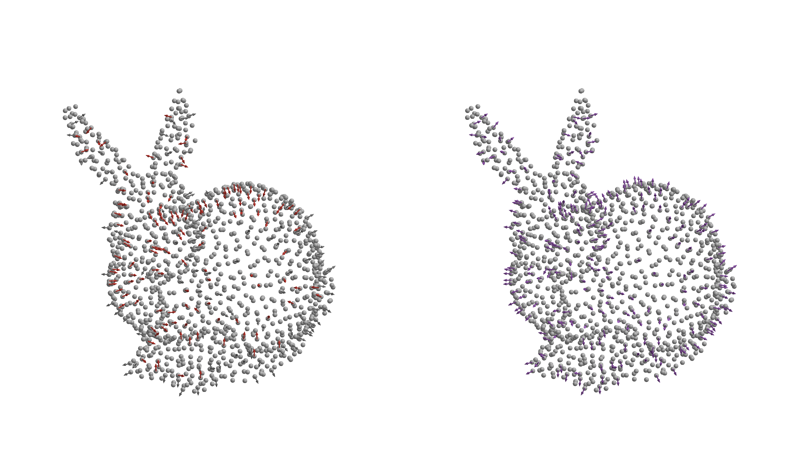

```@meta
CurrentModule = WhatsThePoint
```

# Boundary & Normals

This page covers operations on boundary surfaces: normal computation and orientation, surface splitting and combining, and shadow point generation.

## Normal Computation

Normals are computed via **PCA on local neighborhoods** (Hoppe et al. 1992). For each point, a k-nearest neighbor set is found, the covariance matrix of the local neighborhood is formed, and the eigenvector corresponding to the smallest eigenvalue gives the normal direction.

```julia
normals = compute_normals(points; k=10)
```

The keyword `k` (default 5) controls the neighborhood size — larger values produce smoother normals but may miss sharp features.

## Normal Orientation

After computation, normals point in arbitrary directions (PCA gives an axis, not a direction). Consistent orientation uses a **minimum spanning tree with DFS traversal**:

1. Build a k-nearest neighbor graph weighted by `1 - |nᵢ ⋅ nⱼ|` (normals pointing similarly have low weight)
2. Compute the minimum spanning tree
3. Start from the point with the highest coordinate value (guaranteed to be on the convex hull)
4. DFS through the MST, flipping each normal to agree with its parent

```julia
orient_normals!(normals, points; k=10)
```



*Left: raw PCA normals — each sign is arbitrary, and the red arrows point the wrong way. Right: after `orient_normals!`, every normal points consistently outward.*

To recompute normals in place on an existing surface (e.g. after its points change), then re-orient them:

```julia
update_normals!(surf; k=10)
orient_normals!(surf; k=10)
```

## Surface Splitting

Identify distinct geometric faces (walls, inlets, outlets) so you can apply different boundary conditions to each.

`split_surface!` divides a surface into sub-surfaces based on normal angle discontinuities:

1. Build a k-nearest neighbor graph on the surface points
2. Remove edges where the angle between adjacent normals exceeds the threshold
3. Find connected components in the pruned graph
4. Each connected component becomes a new named surface

```julia
# Returns the new names, in component order
parts = split_surface!(boundary, 75°)  # e.g. [:surface1_1, :surface1_2, :surface1_3]
```

Sub-surfaces are named after the surface they came from, so splitting a boundary sampled
from a multi-STL [`Triangulation`](@ref) keeps each patch's identity: `split_surface!(boundary,
:tank, 75°)` yields `:tank_1`, `:tank_2`, … while `:impeller` and `:baffles` stay untouched.
The parent name is the provenance — `:tank_2` came from `:tank` — which is what you rename to
a physical role before assigning boundary conditions.

## Surface Combining

Merge multiple named surfaces back into one:

```julia
combine_surfaces!(boundary, :surface1_1, :surface1_2)
```

The first name is kept and the second surface is merged into it.

## Shadow Points

Shadow points are virtual points offset inward from the boundary along the normal direction. They are used in some meshless methods for enforcing boundary conditions (e.g., Hermite-type RBF-FD).

**Constant offset:**

```julia
shadow = ShadowPoints(0.5mm)
shadow_pts = generate_shadows(surf, shadow)
```

**Variable offset** (function of position):

```julia
shadow = ShadowPoints(p -> spacing(p), 1)  # order parameter
shadow_pts = generate_shadows(surf, shadow)
```

The offset is applied in the **inward** direction (opposite to the outward normal).

## References

- Hoppe, H., DeRose, T., Duchamp, T., McDonald, J., & Stuetzle, W. (1992). Surface reconstruction from unorganized points. *SIGGRAPH '92*.
