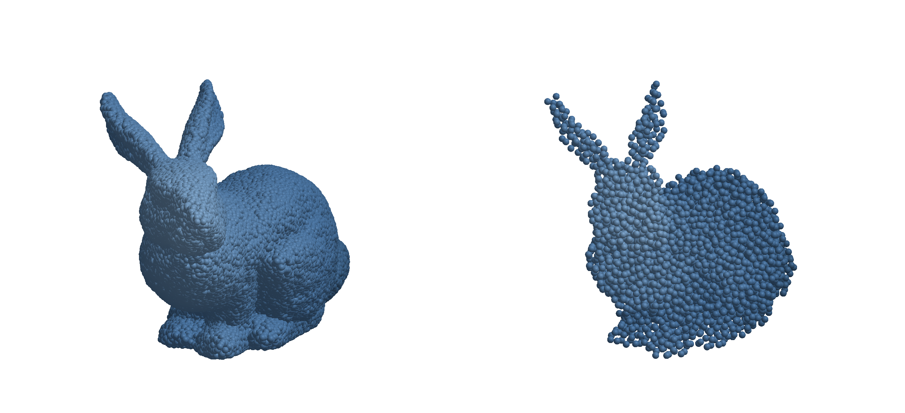

```@meta
CurrentModule = WhatsThePoint
```

# Discretization

Volume discretization generates interior points from a boundary surface. This is typically the second step in the workflow after importing a surface mesh — see the [Guide](guide.md) for the full pipeline.

```julia
cloud = discretize(boundary, spacing; alg=algorithm, max_points=10_000_000)
```

The `max_points` parameter is a safety limit that prevents runaway point generation. It defaults to 10 million. If your target spacing would produce more points than this limit, discretization stops early.

## Algorithm Overview

| Algorithm | Dimensions | Spacing Required | Description |
|-----------|-----------|-----------------|-------------|
| [`SlakKosec`](@ref) | 3D | Yes | Sphere-based candidate generation |
| [`VanDerSandeFornberg`](@ref) | 3D | Yes (`ConstantSpacing` only) | Grid projection with sphere packing |
| [`FornbergFlyer`](@ref) | 2D | Yes (`ConstantSpacing` only) | 1D projection with height-field fill |
| [`DensityAwareOctree`](@ref) | 3D | Yes (variable-friendly) | Octree-guided adaptive fill using local spacing |
| [`OctreeRandom`](@ref) | 3D | No | Octree-guided random point generation |



### Choosing an Algorithm

- **2D problems:** Use [`FornbergFlyer`](@ref) — it is the only 2D algorithm and is selected by default for 2D boundaries.
- **3D with variable spacing:** Use [`DensityAwareOctree`](@ref) with [`BoundaryLayerSpacing`](@ref) for strong near-wall refinement, or [`SlakKosec`](@ref) with `LogLike` for simpler variable spacing.
- **3D with uniform spacing:** [`SlakKosec`](@ref) (default) or [`VanDerSandeFornberg`](@ref) both work. SlakKosec is more general; VanDerSandeFornberg can be faster for simple geometries.
- **Large 3D meshes:** Use [`OctreeRandom`](@ref), [`DensityAwareOctree`](@ref), or pass a `TriangleOctree` to `SlakKosec` for accelerated `isinside` queries. See the [Point-in-Volume & Octree](isinside_octree.md) page.

## DensityAwareOctree

Adaptive 3D octree-based algorithm that uses the provided spacing function to decide local point density. This makes it suitable for boundary-layer-style discretizations.

```julia
mesh = GeoIO.load("model.stl").geometry
boundary = PointBoundary(mesh)

spacing = BoundaryLayerSpacing(
	points(boundary);
	at_wall=0.6m,
	bulk=4.0m,
	layer_thickness=8.0m,
)

alg = DensityAwareOctree(mesh; placement=:jittered, boundary_oversampling=2.0)
cloud = discretize(boundary, spacing; alg=alg, max_points=200_000)
```

For a complete runnable script, see:
- [examples/density_aware_discretization.jl](https://github.com/JuliaMeshless/WhatsThePoint.jl/blob/main/examples/density_aware_discretization.jl)

## SlakKosec

Default algorithm for 3D discretization. Generates candidate points on spheres around existing points, accepting those that are inside the domain and sufficiently far from existing points.

```julia
# Basic usage
cloud = discretize(boundary, spacing; alg=SlakKosec())

# Custom number of candidates per sphere (default: 10)
cloud = discretize(boundary, spacing; alg=SlakKosec(20))

# With octree acceleration for faster isinside queries
octree = TriangleOctree("model.stl"; min_ratio=1e-6)
cloud = discretize(boundary, spacing; alg=SlakKosec(octree))
cloud = discretize(boundary, spacing; alg=SlakKosec(20, octree))
```

Supports both `ConstantSpacing` and variable spacings (`LogLike`).

## VanDerSandeFornberg

3D algorithm that projects a 2D grid onto the shadow plane and fills the volume layer by layer using sphere packing heights.

```julia
cloud = discretize(boundary, ConstantSpacing(1mm); alg=VanDerSandeFornberg())
```

Requires `ConstantSpacing`. Uses `isinside` (Green's function) for filtering generated points.

## FornbergFlyer

2D-only algorithm. Uses a similar height-field approach as VanDerSandeFornberg, but projects onto the x-axis for 2D domains.

```julia
cloud = discretize(boundary, ConstantSpacing(0.1mm); alg=FornbergFlyer())
```

This is the default (and only) algorithm for 2D boundaries.

## OctreeRandom

Generates volume points directly from an octree decomposition of the domain. The octree classifies leaf nodes as interior, boundary, or exterior. Interior leaves are filled with random points directly (100% acceptance rate), while boundary leaves are oversampled and filtered with the octree-accelerated `isinside` test.

**Spacing is ignored** — point density is controlled by octree parameters (`tolerance_relative`, `min_ratio`). Use any spacing value for API consistency.

```julia
# From a mesh file (recommended — auto-computes min_ratio)
cloud = discretize(boundary, ConstantSpacing(1m); alg=OctreeRandom("model.stl"))

# With explicit min_ratio
cloud = discretize(boundary, ConstantSpacing(1m); alg=OctreeRandom("model.stl"; min_ratio=1e-6))

# From a pre-built TriangleOctree
octree = TriangleOctree("model.stl"; min_ratio=1e-6)
cloud = discretize(boundary, ConstantSpacing(1m); alg=OctreeRandom(octree))

# With custom boundary oversampling (default: 2.0)
cloud = discretize(boundary, ConstantSpacing(1m); alg=OctreeRandom(octree, 3.0))
```

Parameters:
- `min_ratio` — Minimum octree box size as fraction of mesh diagonal. Auto-computed if omitted.
- `tolerance_relative` — Vertex coincidence tolerance as fraction of mesh diagonal.
- `boundary_oversampling` — Oversampling factor for boundary leaves (default: 2.0). Higher values improve boundary coverage at the cost of more rejected candidates.
- `verify_interior` — Verify generated interior points with `isinside` (default: `false`). Usually unnecessary since leaf classification is reliable.
- `verify_orientation` — Check mesh normal consistency before building the octree (default: `true`).

## Spacing Types

Spacing controls point density for algorithms that require it (all except `OctreeRandom`).

### ConstantSpacing

Uniform spacing everywhere in the domain:

```julia
spacing = ConstantSpacing(1mm)
```

Works with all algorithms.

### BoundaryLayerSpacing

Variable spacing specifically designed for boundary-layer refinement.

```julia
spacing = BoundaryLayerSpacing(
	points(boundary);
	at_wall=0.6m,
	bulk=4.0m,
	layer_thickness=8.0m,
)
```

- `at_wall` controls the smallest spacing near the boundary.
- `bulk` controls the largest spacing far from the boundary.
- `layer_thickness` sets how fast spacing transitions from wall to bulk.

Works especially well with [`DensityAwareOctree`](@ref).

### LogLike

Variable spacing that is denser near the boundary and coarser in the interior. Uses a logarithmic-like growth function:

```julia
spacing = LogLike(cloud, base_size, growth_rate)
```

- `cloud` — An existing `PointCloud`. LogLike uses the cloud's boundary points to compute distances, so you must first create a cloud with `ConstantSpacing`, then use `LogLike` for a second-pass refinement.
- `base_size` — Spacing at the boundary surface.
- `growth_rate` — Rate at which spacing increases away from the boundary. Values > 1 create coarser interior points.

The spacing at a point is computed as `base_size * x / (a + x)` where `x` is the distance to the nearest boundary point.

Works with `SlakKosec` only.

**Typical workflow:**
```julia
# First pass with uniform spacing
cloud = discretize(boundary, ConstantSpacing(1mm); alg=SlakKosec())

# Second pass with variable spacing
spacing = LogLike(cloud, 0.5mm, 1.2)
cloud = discretize(boundary, spacing; alg=SlakKosec())
```

## References

- Slak, J. & Kosec, G. (2019). On generation of node distributions for meshless PDE discretizations. *SIAM Journal on Scientific Computing*, 41(5).
- Van der Sande, K. & Fornberg, B. (2021). Fast variable density 3-D node generation. *SIAM Journal on Scientific Computing*, 43(1).
- Fornberg, B. & Flyer, N. (2015). Fast generation of 2-D node distributions for mesh-free PDE discretizations. *Computers & Mathematics with Applications*, 69(7).
