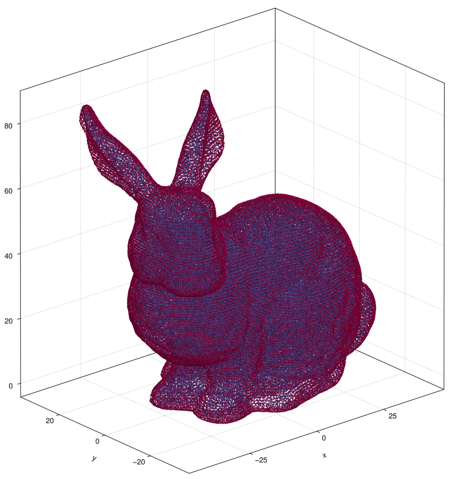

```@meta
CurrentModule = WhatsThePoint
```

# WhatsThePoint.jl

[](https://github.com/JuliaMeshless/WhatsThePoint.jl/actions/workflows/CI.yml?query=branch%3Amain)
[](https://JuliaMeshless.github.io/WhatsThePoint.jl/stable)
[](https://JuliaMeshless.github.io/WhatsThePoint.jl/dev)
[](https://github.com/JuliaMeshless/WhatsThePoint.jl/blob/master/LICENSE)

Documentation for [WhatsThePoint](https://github.com/JuliaMeshless/WhatsThePoint.jl).

This package provides tools for generating and manipulating point clouds for meshless PDE methods. It handles the full workflow from surface mesh import through volume discretization, point distribution optimization, and connectivity computation.

## Installation

Simply install the latest stable release using Julia's package manager:

```julia
] add https://github.com/JuliaMeshless/WhatsThePoint.jl
```

## Quick Start

Although there are a number of features in this package, the initial use case is for
generating point clouds for use in numerical solution of PDEs via a meshless method.

You can load a surface mesh and extract the boundary points using the `PointBoundary`
constructor.

```@example quickstart
using WhatsThePoint
boundary = PointBoundary(joinpath(@__DIR__, "assets/bunny.stl"))
```

and we can visualize it with

```julia
using GLMakie
visualize(boundary; markersize=0.15)
```


Then we can generate a point cloud using `discretize`.

```julia
spacing = ConstantSpacing(1m)
cloud = discretize(boundary, spacing; alg=VanDerSandeFornberg(), max_points=100_000)
```

and we can visualize again with `visualize(cloud; markersize=0.15)`



### Octree-Accelerated Discretization

For large meshes, you can use `OctreeRandom` which builds an octree from the surface mesh and generates volume points directly from the tree structure — no spacing parameter needed:

```julia
cloud = discretize(boundary, OctreeRandom("model.stl"; h_min=0.5))
```

Or pass a pre-built `TriangleOctree` to `SlakKosec` for accelerated point-in-volume queries:

```julia
octree = TriangleOctree("model.stl"; h_min=0.5)
cloud = discretize(boundary, spacing; alg=SlakKosec(octree))
```

See the [Octree](@ref) and [Discretization](@ref) pages for details.

## Adding Topology (Point Connectivity)

For meshless PDE solvers, you often need to know the neighbors of each point (the stencil).
WhatsThePoint can compute and store this connectivity:

```julia
# Add k-nearest neighbor topology (21 neighbors per point)
cloud = set_topology(cloud, KNNTopology, 21)

# Access neighbors
all_neighbors = neighbors(cloud)        # Vector{Vector{Int}}
point_5_neighbors = neighbors(cloud, 5) # neighbors of point 5

# Check topology state
hastopology(cloud)  # true
```

Alternatively, use radius-based topology where all points within a given distance are neighbors:

```julia
cloud = set_topology(cloud, RadiusTopology, 2mm)
```

!!! note
    `set_topology` returns a new object with the computed topology. Operations that move
    points (like `repel`) also return new objects with `NoTopology`, since the connectivity
    is no longer valid after points have moved. Simply call `set_topology` again after repulsion.
