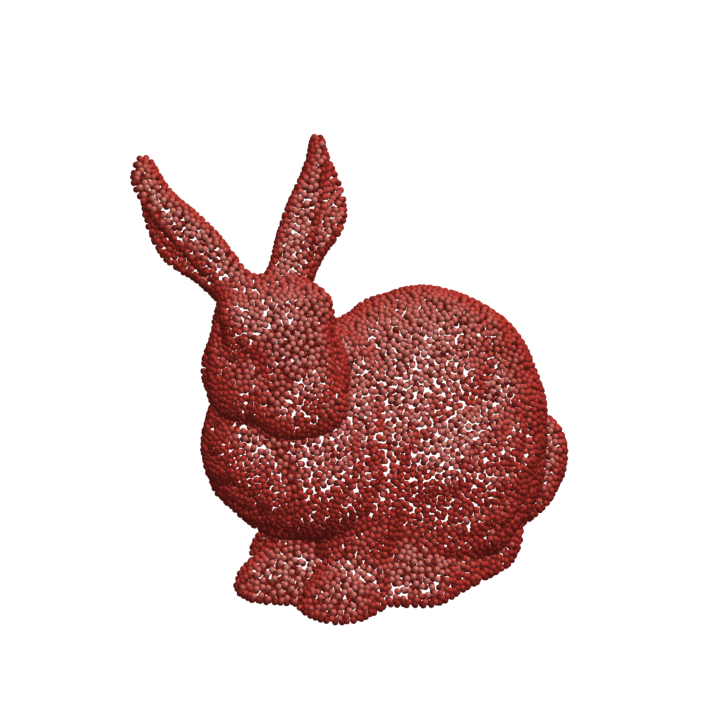
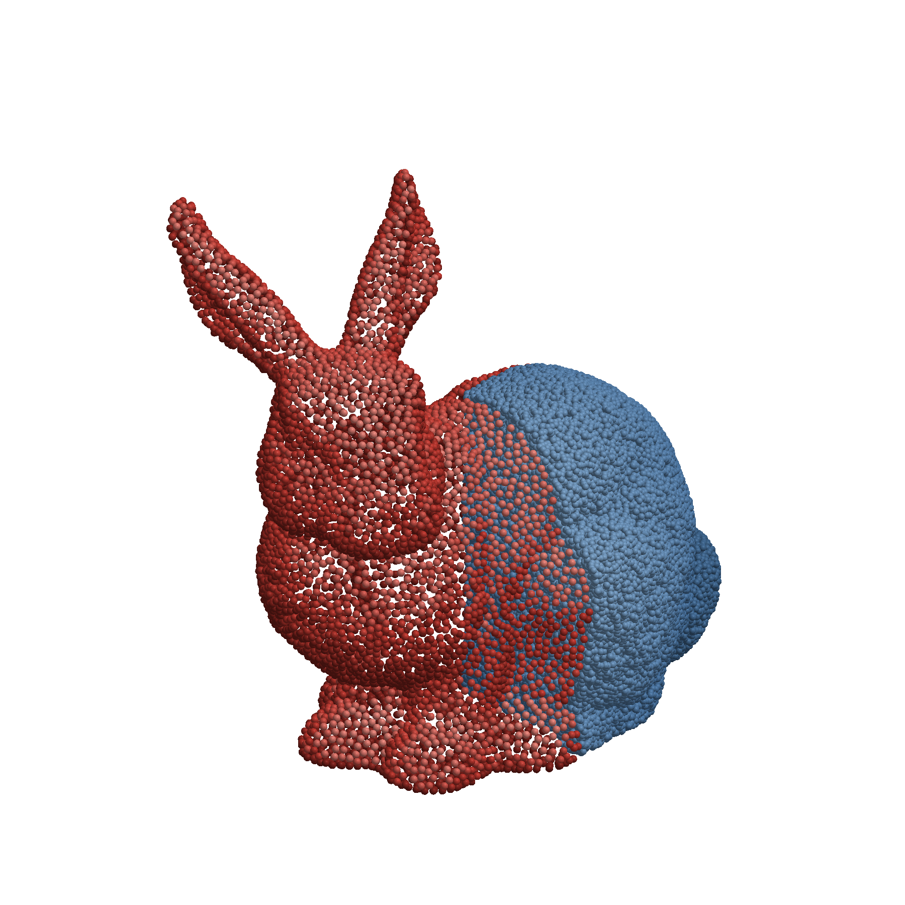

```@raw html
---
layout: home

hero:
  name: "WhatsThePoint.jl"
  text: "Point clouds for meshless PDE methods"
  tagline: Generate, optimize, and connect point clouds — from CAD surface to solver-ready in a few lines of Julia.
  image:
    src: /hero.png
    alt: Discretized Stanford bunny point cloud with cutaway showing interior points
  actions:
    - theme: brand
      text: Get Started
      link: /quickstart
    - theme: alt
      text: Guide
      link: /guide
    - theme: alt
      text: API Reference
      link: /api
    - theme: alt
      text: View on GitHub
      link: https://github.com/JuliaMeshless/WhatsThePoint.jl

features:
  - icon: 📥
    title: Import & Sample Surfaces
    details: Load STL, OBJ, or any GeoIO.jl format with explicit units, then Poisson-disk sample the surface at exactly the spacing you want.
    link: /guide
  - icon: 🫧
    title: Fill the Volume
    details: Four discretization algorithms generate well-spaced interior points, including spacing-driven adaptive octree fill with graded Poisson-disk fronts.
    link: /discretization
  - icon: 🧲
    title: Optimize the Distribution
    details: Node repulsion relaxes point clouds toward blue-noise quality, with boundary-aware projection and quality-based stopping.
    link: /repel
  - icon: 🕸️
    title: Build Stencil Connectivity
    details: k-nearest neighbor and radius-based topologies give every point the neighborhood your meshless solver needs.
    link: /concepts
  - icon: 📐
    title: Units & Quality Metrics
    details: Full Unitful.jl integration and built-in separation, fill, and spacing-fidelity metrics keep discretizations honest.
    link: /api
  - icon: ⚡
    title: Fast by Default
    details: Threaded operations via OhMyThreads.jl, cache-friendly StructArray storage, and octree-accelerated O(1) point-in-volume queries.
    link: /isinside_octree
---
```

```@meta
CurrentModule = WhatsThePoint
```

```@raw html
<div class="vp-doc quick-example" style="width:80%; margin:auto">
```

## Quick Example

Load a surface mesh and inspect the boundary structure:

```@example quickstart
using WhatsThePoint
using Unitful: m
mesh = import_mesh(joinpath(@__DIR__, "assets/bunny.stl"), m)
boundary = PointBoundary(mesh)
```

```julia
using GLMakie
visualize(boundary; markersize=0.15)
```



Generate volume points with `discretize`:

```julia
spacing = ConstantSpacing(1m)
cloud = discretize(boundary, spacing; alg=Octree(mesh))
```

```julia
visualize(cloud; markersize=0.15)
```



## Installation

```julia
using Pkg
Pkg.add(url="https://github.com/JuliaMeshless/WhatsThePoint.jl")
```

```@raw html
</div>
```
