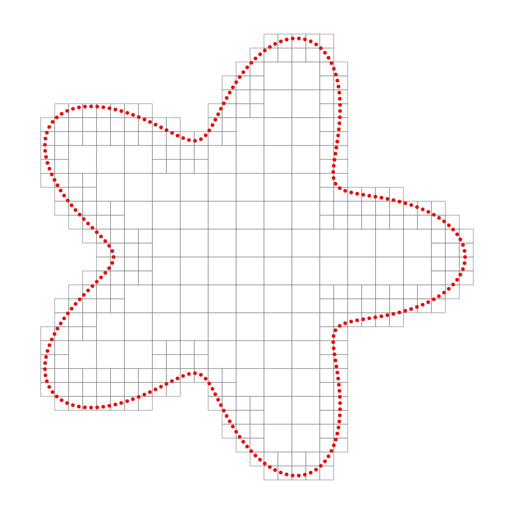
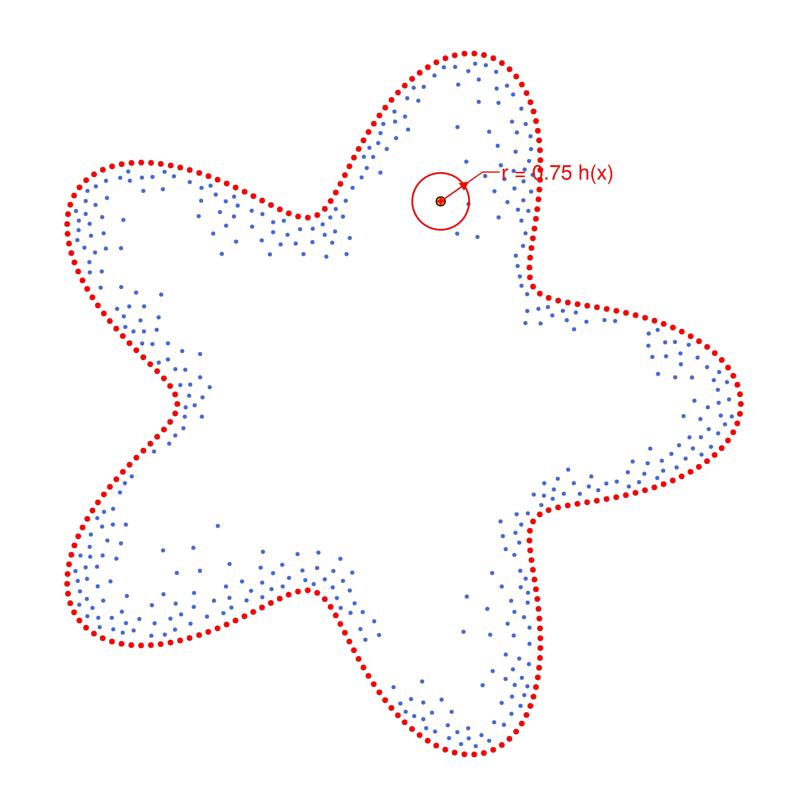
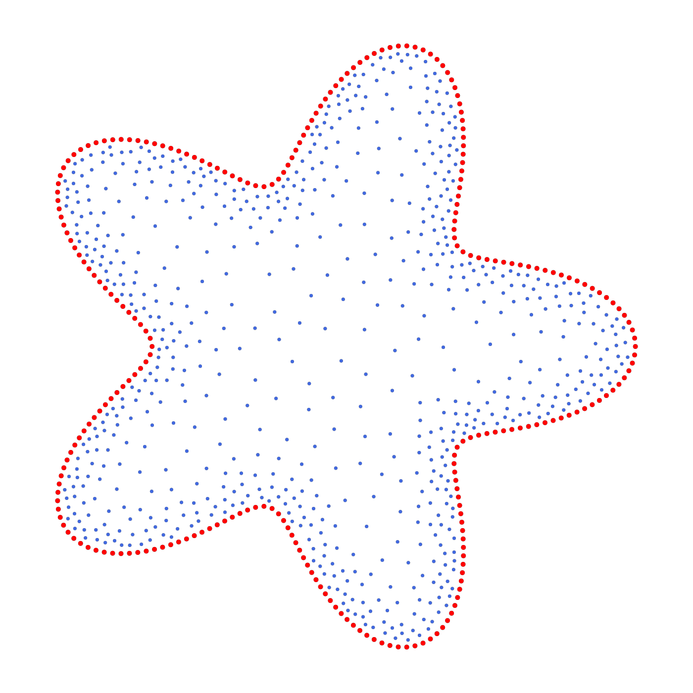

```@meta
CurrentModule = WhatsThePoint
```

# Octree Algorithm

`Octree` is a discretization algorithm for 3D and 2D domains that uses a spacing function (for example `BoundaryLayerSpacing`) to adapt point density:

- finer near walls/boundaries,
- coarser in the bulk interior.

This is useful for CFD and boundary-layer-dominated meshless simulations where you need high resolution close to surfaces without over-resolving the full volume.

## Basic Usage

```julia
using WhatsThePoint
using Unitful: m

mesh = import_mesh("model.stl", m)
boundary = PointBoundary(mesh)

spacing = BoundaryLayerSpacing(
    points(boundary);
    at_wall=0.6m,
    bulk=4.0m,
    layer_thickness=8.0m,
)

alg = Octree(mesh)
cloud = discretize(boundary, spacing; alg)   # max_points auto-estimated
```

The algorithm is designed primarily for 3D geometries — its production home
is volume discretization of surface meshes. A 2D counterpart is available and
behaves identically (see [2D Domains](#2d-domains) below); the figures on this
page use a 2D domain because the mechanics are easier to see in the plane.

The first stage is the spacing-driven node tree (octree in 3D, quadtree in
2D): boxes subdivide until their size satisfies `h_box ≤ alpha · h(x)`, so the
tree is fine where the prescribed spacing is fine — here, near the wall:



*The node quadtree over a starfish boundary (red points). With a graded
`BoundaryLayerSpacing`, boxes refine toward the wall; the tree only keeps
boxes that can host domain points.*

## Bridson Placement (default)

The default placement mode, `:bridson`, runs a single global advancing-front Poisson-disk pass (Bridson 2007) graded to the spacing field `h(x)`: every generated point keeps a distance of at least `min(rᵢ, rⱼ)` with `r = bridson_factor·h(x)` from every other point — including the boundary seeds — by construction. The front saturates on its own, so no refinement or repulsion pass is needed afterward, and `max_points` acts as a non-truncating cap (auto-estimated from the spacing integral when unset; a warning fires if a hand-set cap truncates the front).

With `max_growth > 0`, the prescribed spacing is replaced by its gradient-limited (Lipschitz) envelope before sampling, so steep boundary layers transition smoothly instead of jumping — `0.1`–`0.2` matches typical CFD growth ratios of 1.1–1.2.

A too-coarse spacing (one the domain cannot host an interior at) is clamped with a loud warning instead of silently producing an empty cloud; run [`suggest_spacing`](@ref) first to pick a viable spacing deliberately.



*Bridson placement is dart throwing: candidate points are proposed around the
advancing front and accepted only if they pass a set of rules. The decisive
one is spacing satisfaction — the candidate must have no neighbor within its
spacing radius `r = bridson_factor · h(x)` (a disk in 2D, a sphere in 3D).
The encircled point is an accepted dart: its disk contains no other point,
by construction.*

## 2D Domains

The same algorithm runs on 2D boundaries — and is the 2D default, so
`discretize(bnd, spacing)` already uses it. A `SegmentQuadtree` indexes the
segments of one or more closed loops, and the node tree, leaf classification,
and Bridson front work exactly as in 3D. A boundary is just an ordered loop of
points — build it, and the familiar three lines apply (passing `alg` explicitly
here only to show where the geometry index comes from):

```julia
using WhatsThePoint
using Unitful: m

# Starfish boundary: sample a parametric curve at ~equal arc length
r(θ) = 1 + 0.3 * cos(5θ)
θs = range(0, 2π; length = 20_000)
xs, ys = r.(θs) .* cos.(θs), r.(θs) .* sin.(θs)
arclen = cumsum(hypot.(diff(xs), diff(ys)))
targets = range(0, arclen[end]; length = 259)[1:(end - 1)]
idx = [searchsortedfirst(arclen, t) for t in targets]
pts = Point.(collect(zip(xs[idx], ys[idx])))

bnd = PointBoundary(pts)                # ordered loop of boundary points
spacing = BoundaryLayerSpacing(
    points(bnd);
    at_wall = 0.035m, bulk = 0.14m, layer_thickness = 0.35m,
)
alg = Octree(bnd; spacing)              # SegmentQuadtree geometry index
cloud = discretize(bnd, spacing; alg)
```



*The finished cloud: boundary points (red) and the graded interior fill
(blue) — dense in the wall layer, coarse in the core, Poisson-disk quality
throughout.*

Passing multiple surfaces (loops) in the `PointBoundary` describes
multiply-connected domains: outer boundary plus holes. Loop orientation does
not matter — it is normalized automatically.

## Parameters

The constructor supports the same octree controls used elsewhere, plus placement options for candidate generation:

- octree refinement controls (`tolerance_relative`, `min_ratio`, `node_min_ratio`, `alpha`)
- placement mode (`:bridson` default, or per-leaf `:random`, `:jittered`, `:lattice`)
- Bridson disk radius relative to spacing (`bridson_factor`, default 0.75)
- gradient-limited spacing (`max_growth`, default 0 = off)
- boundary leaf oversampling (`boundary_oversampling`, per-leaf modes only)
- orientation and safety checks (`verify_orientation`, etc.)

See [`Octree`](@ref) and [`BoundaryLayerSpacing`](@ref) in the API reference for the exact signatures.

## Included Example Scripts

Full runnable examples are included in this repository:

- [examples/octree_boundary_layer.jl](https://github.com/JuliaMeshless/WhatsThePoint.jl/blob/main/examples/octree_boundary_layer.jl) (3D)
- [examples/octree_quadtree_2d.jl](https://github.com/JuliaMeshless/WhatsThePoint.jl/blob/main/examples/octree_quadtree_2d.jl) (2D)

The 3D script demonstrates:

1. probing the geometry with `suggest_spacing`,
2. Poisson-disk boundary sampling and a steep gradient-limited `BoundaryLayerSpacing`,
3. running `Octree` (Bridson placement, auto point budget),
4. checking quality (`spacing_fidelity_metrics`, `metrics`) and rendering cross-section PNGs with CairoMakie,
5. writing a ParaView `.vtu` via `export_vtk`.

The 2D script builds the starfish domain above and renders the three figures
shown on this page (node quadtree, Bridson dart, finished cloud).

## Notes

- `Octree` supports 3D boundaries (from meshes) and 2D boundaries (closed
  loops of ordered points).
- For uniform spacing, `SlakKosec` is a good alternative in 3D.
- If your model scale changes significantly, tune `at_wall`, `bulk`, and `layer_thickness` in physical units.
