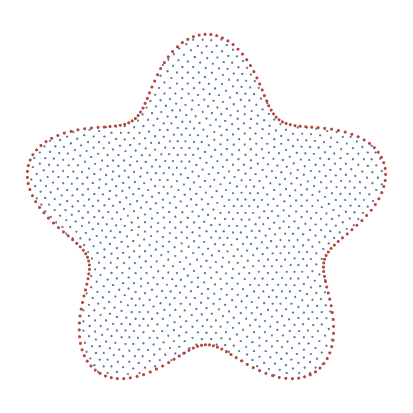

```@meta
CurrentModule = WhatsThePoint
```

# Quick Start

## Installation

```julia
using Pkg
Pkg.add(url="https://github.com/JuliaMeshless/WhatsThePoint.jl")
```

## 3D Example: Surface Mesh to Solver-Ready Point Cloud

```julia
using WhatsThePoint
using Unitful: mm, °

# 1. Import a surface mesh — the unit says what the file's raw numbers mean
mesh = import_mesh("model.stl", mm)
boundary = PointBoundary(mesh)

# 2. Split into named surfaces by normal angle
split_surface!(boundary, 75°)

# 3. Generate volume points
spacing = ConstantSpacing(1mm)
cloud = discretize(boundary, spacing; alg=Octree(mesh))

# 4. Optimize point distribution (optional — Bridson placement is already blue-noise)
cloud = repel(cloud, spacing)

# 5. Build neighbor connectivity
cloud = set_topology(cloud, KNNTopology, 21)

# 6. Ready for your meshless solver
neighbors(cloud, 1)  # neighbor indices for point 1

# 7. Export for ParaView (Representation → Point Gaussian)
export_vtk("cloud", cloud)
```

!!! tip "Not sure what spacing to use?"
    Run `suggest_spacing("model.stl", mm)` first — it probes the geometry and
    recommends a baseline spacing (plus the coarsest spacing the domain can
    host before the interior comes out empty).

## 2D Example: Polygon to Point Cloud

```julia
using WhatsThePoint
using Unitful: m

# 1. Define a 2D boundary — a starfish domain r(θ) = 1 + 0.2 sin(5θ)
θ = range(0, 2π; length=200)[1:(end - 1)]
r = @. 1 + 0.2 * sin(5θ)
boundary = PointBoundary(Point.(r .* cos.(θ), r .* sin.(θ)))

# 2. Discretize with FornbergFlyer (2D algorithm)
spacing = ConstantSpacing(0.05m)
cloud = discretize(boundary, spacing; alg=FornbergFlyer())

# 3. Optimize and connect
cloud = repel(cloud, spacing)
cloud = set_topology(cloud, KNNTopology, 9)
```

Any closed, ordered polygon works — the starfish is a standard test domain in the RBF-FD literature this package grew out of:



*Boundary points in red, generated interior points in blue.*

## Visualization

```julia
using GLMakie

visualize(cloud; markersize=0.15)
```

## Next Steps

- **[Guide](guide.md)** — Full workflow walkthrough with explanations
- **[Concepts](concepts.md)** — Type hierarchy, design decisions, and units
- **[Discretization](discretization.md)** — Algorithm details and spacing options
- **[API Reference](api.md)** — Complete function reference
