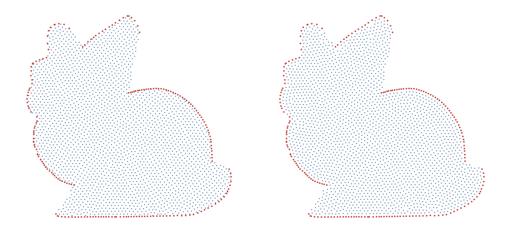

```@meta
CurrentModule = WhatsThePoint
```

# Node Repulsion

## Why Repulsion Matters

Meshless PDE methods (RBF-FD, generalized finite differences) are sensitive to point distribution quality. Irregular spacing leads to poorly conditioned interpolation matrices and reduced accuracy. Node repulsion iteratively pushes points apart to achieve a more uniform distribution while respecting the domain boundary.

With the [`Octree`](@ref) algorithm's default Bridson placement, the generated cloud already satisfies the Poisson-disk criterion, so repulsion is optional polish rather than a required pass — the default [`ClippedSpacingForce`](@ref) is built to preserve (never re-pack) such a cloud.

## Usage

There are two methods, selected by dispatch:

### Volume-only (no octree)

```julia
cloud = repel(cloud, spacing; β=0.2, max_iters=1000)
```

Only volume (interior) points move. Boundary points remain fixed. Any volume point pushed outside the domain is filtered out via `isinside`, so the total point count may decrease.

### Boundary-aware (with `TriangleOctree`, 3D only)

```julia
octree = TriangleOctree(import_mesh("model.stl", u"m"); classify_leaves=true)
cloud = repel(cloud, spacing, octree; β=0.2, max_iters=1000)
```

All points (boundary and volume) participate in repulsion. Escaped points are projected back to the nearest mesh triangle, so no points are lost. The boundary is returned as a single unified surface named `:boundary` — use `split_surface!` to re-establish surface distinctions.

### Convergence history

```julia
conv = Float64[]
cloud = repel(cloud, spacing; β=0.2, max_iters=1000, convergence=conv)
```

[`repel`](@ref) returns a new cloud with [`NoTopology`](@ref) since points have moved — call [`set_topology`](@ref) again after repulsion. Pass a `Vector{Float64}` via the `convergence` keyword to collect the convergence history.

## Parameters

| Parameter | Default | Description |
|-----------|---------|-------------|
| `force_model` | `ClippedSpacingForce(β)` | Force law, any [`RepelForceModel`](@ref) subtype |
| `β` | `0.2` | Repulsion softening — feeds the default `force_model` |
| `α` | `0.05 × min(spacing)` | Step size — distance points move per iteration |
| `k` | `21` | Number of nearest neighbors used in repulsion stencil |
| `max_iters` | `1000` | Maximum number of repulsion iterations |
| `tol` | `1e-6` | Convergence tolerance on the force norm (the default force's residual plateaus above it — the quality stops below are the practical criteria) |
| `cv_target` | `0` (off) | Stop once the d_NN/spacing CV reaches this quality (`≈ 0.07` matches direct generation) |
| `stall_after` | `50` | Stop after this many iterations without CV improvement (`0` disables) |
| `kick_after` | `0` (off) | Break balanced standoffs by kicking the frozen closest pair |
| `cull_ratio` | `0` (off) | Post-relaxation near-duplicate safety net; warns whenever it removes anything |
| `deposit_ratio` | `0` (off) | Octree method only: convert escaped volume points into boundary points (emergent surface sampling) |
| `rebuild_every` | `1` | Iterations between k-NN graph rebuilds (larger = cheaper, staler) |

## Force Models

The force law is abstracted through [`RepelForceModel`](@ref) so users can choose
how points interact. All models take a softening parameter `β` and
implement `compute_force(model, u)` where `u = r / s` is the ratio of neighbor
distance to local target spacing.

### [`ClippedSpacingForce`](@ref) — default

```math
F(u) = \begin{cases} \dfrac{u_0^2 - u^2}{(u^2 + \beta)^2} & u < u_0 \\ 0 & u \ge u_0 \end{cases}
```

Repulsion-only with compact support. Any configuration whose pairwise
distances all exceed `u0·s` is an exact equilibrium — the Poisson-disk
property — so an already-good (blue-noise) cloud is preserved or improved
rather than re-packed. This is the right default for polishing seeded clouds
and for re-relaxation inside a shape-optimization loop.

### [`InverseDistanceForce`](@ref)

```math
F(u) = \frac{1}{(u^2 + \beta)^2}
```

Purely repulsive and monotonically decreasing. This is the original Miotti
(2023) formulation. The force has no root, so equilibrium is reached only
through damping via `α` — the point configuration never stops moving on its
own, which is why a `tol` threshold is needed.

### [`SpacingEquilibriumForce`](@ref)

```math
F(u) = \frac{1 - u^2}{(u^2 + \beta)^2}
```

Zero at `u = 1` (neighbor exactly at the target spacing), positive for `u < 1`
(push apart), negative for `u > 1` (pull together). Caution: the attractive
branch behaves like a cohesion force whose preferred bond length is
unreachable at the prescribed density, so long relaxations slowly condense
the cloud into clusters and voids (rising spacing CV and coordination). Prefer
[`ClippedSpacingForce`](@ref) unless you specifically want gap-filling
attraction.

```julia
cloud = repel(cloud, spacing, octree;
              force_model = SpacingEquilibriumForce(0.2),
              max_iters = 500)
```

## Tuning Guide

- **`β` (repulsion strength):** Values in the range 0.1–0.5 work well for most problems. Smaller values give gentler repulsion (slower convergence, more stable). Larger values produce stronger forces (faster convergence, risk of oscillation).
- **`k` (neighbor count):** Should roughly match the stencil size your meshless solver will use. Too small and points only feel local pressure; too large and the computation slows without benefit.
- **`α` (step size):** The default (5% of minimum spacing) is conservative. Increase for faster convergence on well-behaved geometries; decrease if points escape the domain.
- **`max_iters`:** 1000 is usually sufficient. Check the convergence vector to see if more iterations are needed.

## Algorithm Details

Each iteration:

1. Rebuild the k-nearest neighbor tree from the current positions (every
   `rebuild_every` iterations)
2. For each point, compute a force from its `k` neighbors using the chosen
   [`RepelForceModel`](@ref). See [Force Models](#Force-Models) above for the
   available laws.
3. Move each point by an adaptive step `α_i = clamp(1/|F_i|, α_min, α)` scaled
   by the local spacing and capped at one spacing unit
4. Constrain points to the domain:
   - **Without octree:** points pushed outside are reverted (and filtered at the end via `isinside`)
   - **With octree:** boundary points are re-projected onto the mesh; escaped volume points revert, or convert into boundary points when `deposit_ratio > 0`
5. Record the force norm `max_i(|F_i|·s_i)` as the convergence metric, and
   check the stopping criteria: `tol` on the force norm, `cv_target` /
   `stall_after` on the d_NN/spacing coefficient of variation

## Convergence Monitoring

The convergence vector records the force norm `max_i(|F_i|·s_i)` at each iteration:

```julia
conv = Float64[]
cloud = repel(cloud, spacing; β=0.2, max_iters=500, convergence=conv)

println("Final force norm: ", conv[end])
println("Iterations used: ", length(conv))
```

For the default repulsion-only force, the residual of a saturated packing plateaus at a nonzero value rather than decaying to `tol` — that is expected, and it is why the quality-based stops are the practical criteria: `stall_after` (on by default) ends the run once the d_NN/spacing CV stops improving, and `cv_target` stops at an explicit quality (`≈ 0.07` matches what direct generation delivers). A run that hits `max_iters` warns.



## Verifying Distribution Quality

Use `metrics` to quantify the point distribution before and after repulsion:

```julia
# Before repulsion
metrics(cloud)

# After repulsion
cloud_repelled = repel(cloud, spacing)
metrics(cloud_repelled)
```

`metrics` prints the average, standard deviation, maximum, and minimum distances to each point's k nearest neighbors, plus the global separation (smallest nearest-neighbor distance), fill (largest), and their ratio — a mesh ratio near 1 means blue-noise-even. [`spacing_fidelity_metrics`](@ref) additionally measures `d_NN/h(x)` against the prescribed spacing (mean, CV, percentiles, coordination number).

## Reference

- Miotti, M. (2023). Node repulsion for meshless discretizations.
